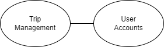
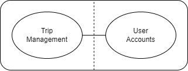
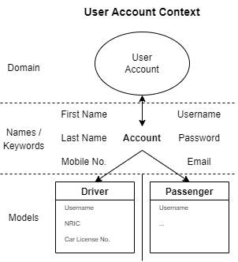

# Applying Domain-Driven Design 
### **Step 1/4: Analyse Business Domain**
In the first step of DDD, a domain model is created in order to the have a bird's eye view of the system to be created and the business domain. From the domain model, all of the business functions and their connections with one another are mapped out. As the case study for this project is relatively simplified, only two main business functions were identified - Trip Management and User Account - as seen in the domain model below.

### **Step 2/4: Define Bounded Contexts**
Usually, in more complex and in-depth business domains, bounded contexts are defined to show the boundaries within a domain where each domain model applies. As there are only two main business functions in the domain model, each of them would belong to a bounded context.

In this step, nouns and verbs are also extracted from the functional requirements. The extracted nouns would help identify any sub-domains and the domain contexts while the extracted verbs would help to identify the connections and relationships between the domains. As there are only two business functions in the domain model, each of them would be in a bounded context.

Within the User Account context, ambiguities may arise when the word "account" is mentioned, as in the case study, two types of accounts - Driver and Passenger - were specified. As such, this domain can be split into two sub-contexts.

### **Step 3/4: Define Entities and Domain Services]**

In the third step, Tactical DDD is applied to identify the entities and domain services.

Entities are objects with an identifier that persists over time. From the case study, the following are the entities identified:
- Driver
- Passenger
- Trip

Domain services implements application logic without holding any state value and provides technical functionality to the application. The following are the domain services identified:
- Create account
- Edit account details
- Request for trip
- Initiate start/end trip for driver
- Retrieve past trips for passenger

---
### **Step 4/4: Identify Microservices**
The last step of DDD involves the identification of the microservices to be implemented. Each microservice should not extend beyond a bounded context. As the user account bounded context contains two sub-contexts - Driver and Passenger, each of them would be a microservice. The third and last microservice here would be the Trip Management microservice, which would interact with both the Driver and Passenger microservices.

---
[Back to main README](./README.md)
